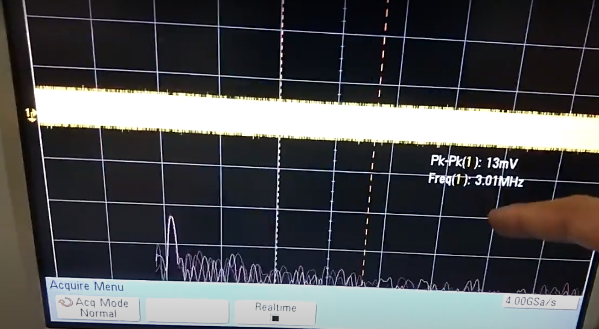

# Welcome to Darth VADAR- a simple 2.4GHz ISM band FMCW RADAR

Sometime back in early 2019, I took the plunge into RF circuits and the first RF design I've always wanted to do was a simple RADAR. [Hforsten](https://hforsten.com) was a big inspiration for this and he frankly made it seem simple enough.
This post is supposed to be a mix of a tutorial and documentation for the RADAR I built along with a couple of my friends.

As I wasn't too picky about the range or the resolution, I decided to choose to operate the RADAR at a center frequency of $$f_0 = 2.45GHz$$ and a maximum bandwidth of $$\Delta f = 100MHz$$ setting the RADAR to work completely within the allocated ISM band. As this band is also where WiFi and BlueTooth reside, finding chips that weren't exorbitantly priced was easy. Another advantage of choosing this frequency was that the dielectric loss of FR4 at this frequency was not too high and could be easily used. This meant that no exotic substrates would be required and any standard PCB fab house could make the PCB's.

## Obligatory introduction to FMCW RADAR
An FMCW RADAR is a specific type of RADAR that is most commonly used to determine the distance and velocity of a target. Due to the high propagation velocity of the electromagnetic waves used, the FMCW RADAR is designed to convert the distance into frequency. The measurement of the velocity of the object varies. For the rest of this introduction, only the measurement of distance will be considered.

Consider a single object with velocity $$v = 0$$ hence static at a distance $$d$$ from the RADAR. To detect the object, let an EM wave pulse be transmitted to irradiate the object. Due to the finite propagation velocity of an EM wave in free space, the time taken for incidence on the target is $\frac{d}{c}$ where $c$ is the speed of light (medium is considered to be air). For a monostatic RADAR with the transmitter and receiver located at the same position, the cumulative round trip time delay is  $$\frac{2d}{c}$$. As this delay is in the order of nanoseconds, accurate and precise measurement is not feasible. Therefore, let the transmitted pulse be frequency modulated by a sawtooth waveform with a time period $$T_{ch}$$. Therefore the frequency can be written as $ f(t) = f_0 + \frac{BW t}{T_{ch}} $. Now a frequency modulated signal can be written as 

\begin{equation}
   Tx(t) = A_{Tx}cos(\int 2\pi f(t)dt)
\end{equation}

On integrating and substituting the expression, we get $ Tx(t) = A_{Tx}cos(2\pi f_0t + \pi \frac{BWt^2}{T_{ch}}) $. As multiple chirps are transmitted, the $ m^{th} $ chirp will have the following equation.

\begin{equation}
  Tx(t) = A_{Tx}cos(2\pi f_0t + \pi (\frac{BW(t - mT_{ch})^2}{T_{ch}})^2)
\end{equation}

In the above equations,
$ f_0 $ is the minimum frequency transmitted
$ BW $ is the bandwidth of the chirp
$ A_{Tx} $ is the amplitude of the transmitted signal

Now once transmitted, the radiated chirp will reflect off a target and will be received by the receiver section of the RADAR. The round trip propagation delay is given by $ t_d $. The received signal can be mathematically expressed as an attenuated and delayed version of the transmitted chirp. Therefore the received signal can be expressed as follows.

\begin{equation}
   Rx(t) = \alpha A_{Tx}cos(2\pi f_0(t - t_d) + 2\pi \frac{BW(t - t_d - mT_{ch})^2}{T_{ch}})
\end{equation}

To determine the round trip time delay, the transmitted and received equations are multiplied(mixed). This operation gives two frequencies of interest, a sum component and another the difference component. The difference component is one of interest and can easily be isolated by lowpass filtering the spectrum obtained from the post mixing operation. On taking the Fourier transform of this difference signal, the spectral component is given as follows

\begin{equation}
      M(j\omega) = 2\pi\alpha A_{Tx}^2 (\delta(\omega + \frac{t_d BW}{T_{ch}}) + \delta(\omega - \frac{t_d BW}{T_{ch}}))
\end{equation}

Clearly, the measured frequency denoted by $ f_{diff} $ is calculated by the following equation

\begin{equation}
      f_{diff} = \frac{t_d BW}{T_{ch}}
\end{equation}

This can further be re-written to express $ f_{diff} $ as a function of the one-way distance between the RADAR and the target denoted by $ d $. On solving for $ d $, we get the following equation

\begin{equation}
   d = \frac{cf_{diff}T_{ch}}{2BW}
\end{equation}

Where $ c $ is the speed of light (we assume the propagating medium to be air)

From the above described equations, the block-diagram of a FMCW RADAR is pretty easily arrived at and is shown below  

## Design of RF Front End
The block diagram is rather easily and directly translated into its circuit-level equivalent. To simplify matters, fully integrated components were used, condensing each block into a single IC and a handful of passives. The chirp is generated off board and is not discussed. For the remainder of the post, focus would be on some of the calculations performed to determine the range of the RADAR and the PCB layout considerations.

The Schematic for the RADAR is attached [here](./docs/schematic.pdf)

### RF Chain Explanation
The RF chain begins with the Voltage Controlled Oscillator(VCO) chosen to be the [MAX2750EUA+](https://datasheets.maximintegrated.com/en/ds/MAX2750-MAX2752.pdf) which requires essentially no external components and provides an AC coupled output. As the output power of the VCO is a paltry $$-3dbBm$$, a power amplifier follows next. The power amplifier chosen is a [GVA-60+](https://www.minicircuits.com/pdfs/GVA-60+.pdf) from Mini-Circuits. This PA is rated to have a power gain of $$+20dB$$ which should boost the signal level to $$17dBm$$. The PA also requires a teensy bit more effort to get up and running than the VCO as it requires a couple of RF Chokes and DC blocking capacitors. The output of the PA is split into two equal paths via a lumped element Wilkinson power divider [PD2425J5050S2HF](https://cdn.anaren.com/product-documents/Xinger/PowerDividers/PD2425J5050S2HF/PD2425J5050S2HF_DataSheet(Rev_A).pdf) from Anaren. Normally, a distributed element Wilkinson divider is used, but in the current band of interest, a lumped element one is far more compact than a distributed element one. This divider from Ananren requires an external $$100\Omega$$ resister. A 0.1% tolerance $$100\Omega$$ high frequency RF resistor was specifically chosen for this which was probably a bit overkill, but I did not want to take any chances. As the power divider chosen splits the power into two equal half, each port delivers a power of $$14dBm$$ to the load attached to it. As the transmitting antenna is connected to one port of the power divider, the net power delivered to the antenna is $$14dBm$$ which will become important later on while determining the range of the RADAR. The other port of the power divider is connected to the mixer, delivering $$14dBm$$ of power to it which is the main driving signal for the double balanced passive mixer. The mixer used is the [MDB-73H+](https://www.minicircuits.com/pdfs/MDB-73H+.pdf) so selected as it requires a typical driving signal power of $$15dBm$$.
The other input to the mixer is the signal reflected by the target which is received by the receiving antenna. As the signal power of this received signal is pretty low, it is amplified by a Low Noise Amplifier, abbreviated as LNA. The LNA used is the [BGA622H6820XTSA1](https://www.mouser.in/datasheet/2/196/infineon_infns12498-1-1735744.pdf) from Infineon semiconductor. In order to improve the insertion loss of the LNA, an LC matching network is placed between the receiving antenna's output and the LNA's input which is as described in the datasheet.

The output spectrum of the mixer contains two different frequencies which is the sum and difference of the two inputs. The sum component lies in the range of $$4.8GHz$$ to $$5GHz$$ which can be filtered out. The difference component lies in the $$0Hz$$ to $$100MHz$$ range. This baseband signal is sampled by an ADC and the fourier transform is computed by an external FPGA.

### System Level Simulation
Before proceeding to the PCB design, the system architecture was simulated in Cadence AWR with the values for every block the same as the corresponding component. The signal at every point in the signal path is shown below.

#### Voltage Controlled Oscillator

The spectrum at the output of the VCO is shown below

#### Power Amplifier

The output power is shown below

#### Power Divider and Transmitting Antenna

The power divider was modeled as per the datasheet similar to the previous components. The antenna used was a custom truncated inset fed microstrip patch antenna, designed and simulated using CST Microwave studio. The 3D farfield pattern was exported into a CSV file and imported into Cadence AWR to account for the antenna characteristics. The design of the antenna is explained in the later sections.

#### Target Model

For the target, a metallic object was used having a diameter of $$16m$$. Two cases were simulated, one where the velocity of the target is $$10ms^{-1}$$ moving away from the RADAR and another simpler case of a static target. The RCS was automatically computed by AWR. The figure shown below is from the case where the target is moving away from the RADAR. AWR assumes multiple reflections and a fading channel for the simulation which results in artifacts during the DSP section.

#### Receiving Antenna and LNA

The receiving antenna has the same design as the transmitting antenna and it was modeled in the same way as the transmitting antenna. For the given target, the LNA power output is shown below.

I[AWR spectrum](img\LNA_spectrum.png)

#### Mixer

#### Bare Minimum Signal Processing Section
The bare minimum signal processing section exists to determine the functionality of the RADAR. 

For this, the bandwidth was restricted to $$25kHz$$ by placing a 7th order Butterworth LC lowpass filter shown below.

To model an ADC of $$50kHz$$, a downsampling block with a downsampling ratio of 10000 was used as the ADC block in AWR Visual System Simulator gives a digital output. The downsampling operation introduces copies of the main signal at other spectral locations which do not correspond to physical objects present at that location which is not of great concern currently as the signal processing chain simulated is more of a formality to verify the functionality of the RADAR and will **not** be implemented in its current format. An added advantage of implementing the ADC as a downsample block is that the signal is coherently sampled eliminating the need for any windowing functions to be used. The output of the downsampled signal is fed into a 128 point FFT block. This 128 point FFT results in a spectral resolution of $$390.625Hz$$ which corresponds to a spatial resolution of roughly $$20cm$$. The entire chain is shown below.

Finally, the output of the entire RADAR is shown below. Rounding the frequency to be a round $20kHz$ and back substituting it in the RADAR distance equation, the distance measured is $$6m$$ which indeed is the set distance of the target.

Note: this result is of the first sweep, at a time where the target has not moved much from its initial location.

### PCB Design
The first thing decided was the PCB Stackup. Defying convention, a **2 layer** $$1.6mm$$ FR4 PCB stackup was chosen to have the following cross-section. 

For the chosen stackup, a Grounded CoPlanar Waveguide(GCPW) structure was used over a more common microstrip transmission line due to its large width at this stackup. The spacing for the GCPW transmission line was calculated using an online calculator for a characteristic impedance of $$50\Omega$$. As I had access to CST-Microwave studio while designing, I simulated the transmission line and tweaked the spacing/geometry a bit to account for the PCB fabrication design rules and also null the effect of the breakout traces used to connect the transmission line to a pin of a required IC. The isometric view of the simulated geometry and results are shown below.

The transmission lines used, provide a sufficiently flat response in the band of interest and were directly used. Small clearance/spacing changes were made in accordance with the manufacturer's tolerances and design rules.

With the transmission line designed, the PCB layout was straightforward and was done in EAGLE CAD. As I had chosen to go ahead with a 2 layer stack up, the bottom layer was a solid ground plane and the top layer was used for transmission lines and occasional power traces. For ease of debugging, each block in the signal path was broken out with an [RF switch](https://www.infineon.com/dgdl/Infineon-BGSA11GN10-DataSheet-v03_02-EN.pdf?fileId=5546d46255dd933d0155e9dac4e809ed) allowing one to isolate and test every single block. In order to be able to truly test every block separately, the *VCC* pins for each block were broken out into a header so that the supply voltage could be provided to only one block at a time simplifying the routing. The complete PCB is shown below.

Note: The LO input to the mixer is connected using an SMA to U.FL cable. This was done by choice so as to be able to feed an external LO signal to verify the functionality of the mixer.

Once the PCB layout was completed, it was imported into CST studio and was simulated to ensure that the impedance was controlled and all transmission lines had a low insertion loss. The important critical parts to be simulated are
1. Simulation of SMA-GCPW transition.
2. Simulation of the curved power divider output transmission lines.
3. Simulation of the U.FL connector transition.
4. LNA input transmission line simulation.

The SMA-GCPW transition was extensively simulated and on performing TDR in CST, an impedance discontinuity was found to exist at the transition point. This was due to the large footprint of the SMA connector resulting in a lower impedance. To mitigate this issue, the lower ground plane was recessed from the edge of the board, increasing the impedance. The amount to be recessed was optimized using the optimizer tool in CST.

Once the transition was optimized, the curved power divider output transmission lines were simulated. After a few iterations, the curve was optimized for the lowest loss. The image of the simulated setup and the resulting S11 parameter is shown below. Note: the planar transmission lines were terminated with an ideal $$50\Omega$$ load.

The LNA input transmission line setup and results is shown below.

## Antenna design

The antenna chosen for the RADAR was a microstrip patch antenna with an inset feed. This was designed using the standard equations. The designed patch is narrow band in nature and would limit the performance of the RF Front end. To increase the bandwidth of the patch, two approaches can be taken
1. Inserting slots into the patch.
2. Trimming the corners.

Of the two approaches, a corner trimmed approach was preferred due to its simplicity. The optimal trimming values were determined using CST studio's optimizer. The parameters for optimization were the dimensions of the cutout to form the inset feed and the dimensions of the triangles which were cut out of the corners. The truncation on all four corners was symmetric. the antenna model, its radiation pattern, and S parameters are shown below.

The simulated antenna has a lower than average gain due to the underwhelming radiative efficiency which drastically reduces the range of the RADAR. As this was just a toy RADAR, the reduced range was not too worrisome. Another issue was the reduced bandwidth. While the initial goal was to achieve a $$100MHz$$ bandwidth, the simulated antenna post corner truncation yielded a bandwidth of $$50MHz$$, sufficient for short-range tests.

## Results

After being satisfied with the simulation results of both the antenna and RF Front End(RFFE), the gerber files were exported and sent in for fabrication. The images of the bare PCB and antenna are shown below.

After spending a couple of hours soldering, the PCB was completely assembled and ready for testing.

### Antenna Test Results

On measuring the antenna's S11 parameter, it was evident that there was a shift in the center frequency of the antenna by roughly $$50MHz$$ as seen in the figure below. This reduced the usable bandwidth to be close to $$25MHz$$, still sufficient for short range testing.

### VCO Test Results

For the VCO test, the VCO's *TUNE* pin was connected to *GND* and the isolator switch was set to a position to bridge the VCO's output to the test port. This port was connected to a spectrum analyzer **through an external DC block** to prevent any DC component present in the output from damaging the spectrum analyzer. This resulted in a drop of a couple of dB which was to be expected. The following image shows the spectrum analyzer output. Note: **When this picture was taken, the spectrum analyzer gave an *UNCAL* error indicating that the displayed power was wrong. On running the self cal and changing the span, the issue was resolved and the correct power level was displayed. Unfortunately, I do not have a picture of it**.

### Power Amplifier and Power Divider test

For the PA and PD test, the switch was set to the state wherein the output of the VCO was connected to the input of the power amplifier. As the power divider has two output ports with one terminated into a $$50\Omega$$ load and the other is connected to a spectrum analyzer through a DC block.

### LNA and Mixer Test

For the LNA and Mixer test, the input of the LNA was connected to a synthesizer producing an output at $$2.03GHz$$ at a power level of $$-28dBm$$ as shown below.

The LO input of the Mixer is connected to a Keysight Vector Signal Generator producing an output at $$2GHz$$ at a power level of $$8dBm$$ as shown below.

The spectrum analyzer is connected to the test point present after the LNA. The output of the mixer is connected to an oscilloscope where the IF signal(in this case) is observed. For measuring the LNA's performance, the switch is set to a state to connect the output of the LNA to the test point. Once the gain of the LNA was verified, the switch's state was changed to connect the LNA output to the mixer's input. The resulting IF must be at $$3MHz$$. This was verified by taking the FFT of the input signal on the oscilloscope as shown below.

